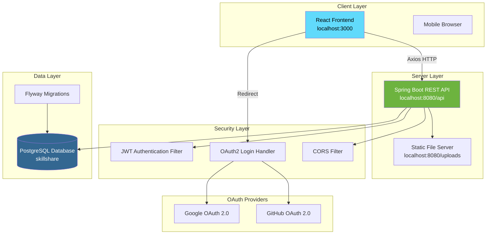
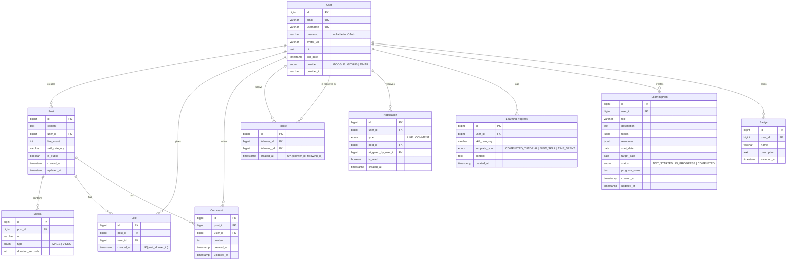
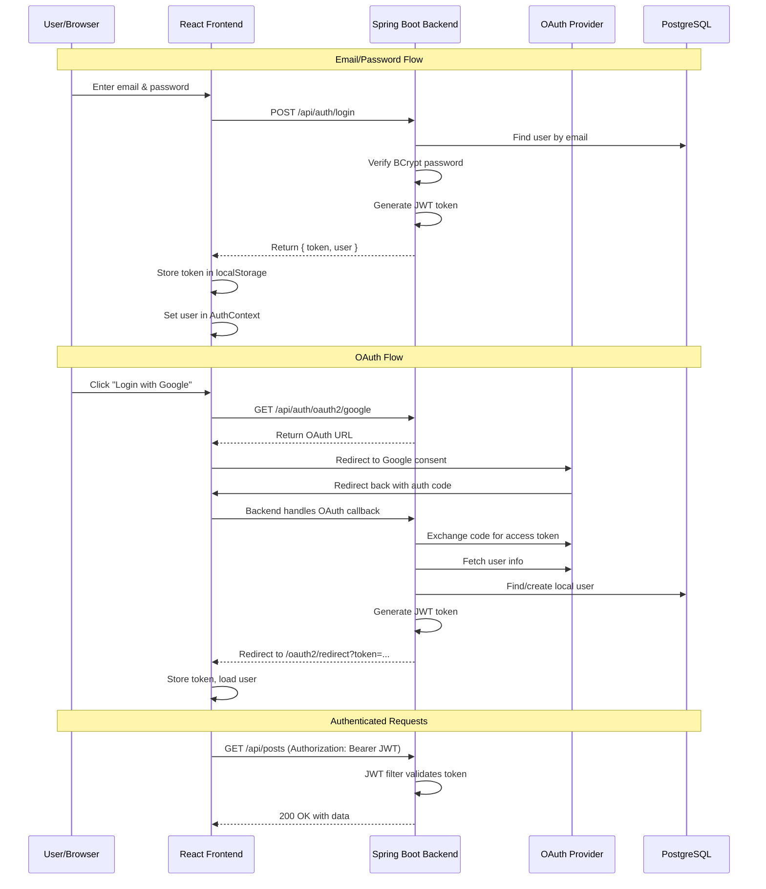
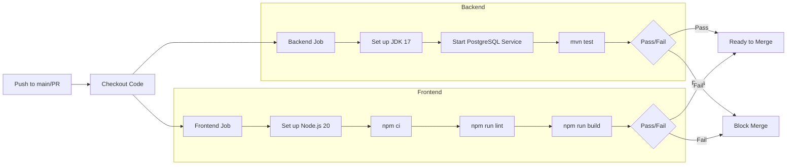

# Architecture Diagrams
## Skill Sharing & Learning Platform

## 1. Overall System Architecture

## 2. REST API Architecture

```mermaid
graph TB
    subgraph "Spring Boot Backend"
        direction TB
        
        subgraph "Controllers Layer"
            AC[AuthController<br/>/api/auth]
            UC[UserController<br/>/api/users]
            PC[PostController<br/>/api/posts]
            CC[CommentController<br/>/api/comments]
            NC[NotificationController<br/>/api/notifications]
            LC[LearningController<br/>/api/progress, /api/plans]
        end

        subgraph "Services Layer"
            AS[AuthService]
            US[UserService]
            PS[PostService]
            CS[CommentService]
            NS[NotificationService]
            LS[LearningService]
        end

        subgraph "Repositories Layer"
            UR[UserRepository]
            PR[PostRepository]
            MR[MediaRepository]
            LR[LikeRepository]
            CR[CommentRepository]
            FR[FollowRepository]
            NR[NotificationRepository]
            LPR[LearningProgressRepository]
            LPR2[LearningPlanRepository]
            BR[BadgeRepository]
        end

        subgraph "Data Models"
            U[User Entity]
            P[Post Entity]
            M[Media Entity]
            L[Like Entity]
            C[Comment Entity]
            F[Follow Entity]
            N[Notification Entity]
            LP[LearningProgress Entity]
            PL[LearningPlan Entity]
            B[Badge Entity]
        end

        subgraph "Security"
            JWT[JWT Util]
            SF[JWT Auth Filter]
            OSH[OAuth2 Success Handler]
        end

        AC --> AS
        UC --> US
        PC --> PS
        CC --> CS
        NC --> NS
        LC --> LS

        AS --> UR
        US --> UR
        US --> FR
        PS --> PR
        PS --> MR
        PS --> LR
        PS --> NR
        PS --> UR
        CS --> CR
        CS --> PR
        CS --> NR
        NS --> NR
        LS --> LPR
        LS --> LPR2
        LS --> BR
        LS --> UR

        AC --> JWT
        PC --> JWT
        SF --> JWT
        OSH --> JWT
        OSH --> UR

        PR --> P
        MR --> M
        LR --> L
        CR --> C
        FR --> F
        NR --> N
        LPR --> LP
        LPR2 --> PL
        UR --> U
        BR --> B
    end

    DB[(PostgreSQL)]
    UR --> DB
    PR --> DB
    MR --> DB
    LR --> DB
    CR --> DB
    FR --> DB
    NR --> DB
    LPR --> DB
    LPR2 --> DB
    BR --> DB
```

## 3. Frontend Component Hierarchy

```mermaid
graph TB
    subgraph "React Frontend"
        A[App.js]
        A --> TC[ThemeContext]
        A --> AUTH[AuthContext]
        A --> R[Router]
        A --> T[Toast Container]

        subgraph "Layout"
            N[Navbar]
            N --> ND[NotificationsDropdown]
        end

        subgraph "Public Pages"
            LP[LoginPage]
            FP[FeedPage]
            PDP[PostDetailPage]
            PP[ProfilePage]
            USP[UserSearchPage]
            OA[OAuthRedirectHandler]
        end

        subgraph "Protected Pages"
            CPP[CreatePostPage]
            MLP[MyLearningPage]
            CPGP[CreateProgressPage]
            CPLP[CreatePlanPage]
        end

        subgraph "Components"
            PC[PostCard]
            CS[CommentSection]
            FB[FollowButton]
            PT[ProgressTimeline]
            PLC[PlanCard]
        end

        A --> N
        R --> LP
        R --> FP
        R --> PDP
        R --> PP
        R --> USP
        R --> OA
        R --> CPP
        R --> MLP
        R --> CPGP
        R --> CPLP

        FP --> PC
        PDP --> PC
        PDP --> CS
        PP --> PC
        PP --> PT
        PP --> PLC
        PP --> FB
        USP --> FB
        MLP --> PT
        MLP --> PLC
        CPGP --> PT
    end

    subgraph "API Services"
        SAPI[api.js]
        SAPI --> AUTHAPI[authAPI]
        SAPI --> USERAPI[userAPI]
        SAPI --> POSTAPI[postAPI]
        SAPI --> COMMENTAPI[commentAPI]
        SAPI --> NOTIFAPI[notificationAPI]
        SAPI --> PROGAPI[progressAPI]
        SAPI --> PLANAPI[planAPI]
    end

    LP --> AUTHAPI
    PC --> POSTAPI
    CS --> COMMENTAPI
    FB --> USERAPI
    ND --> NOTIFAPI
    PT --> PROGAPI
    PLC --> PLANAPI
    CPP --> POSTAPI
    CPGP --> PROGAPI
    CPLP --> PLANAPI

    style A fill:#61dafb,color:#000
    style SAPI fill:#764abc,color:#fff
```

## 4. Database Entity Relationship Diagram

## 5. Authentication Flow

## 6. CI/CD Pipeline

